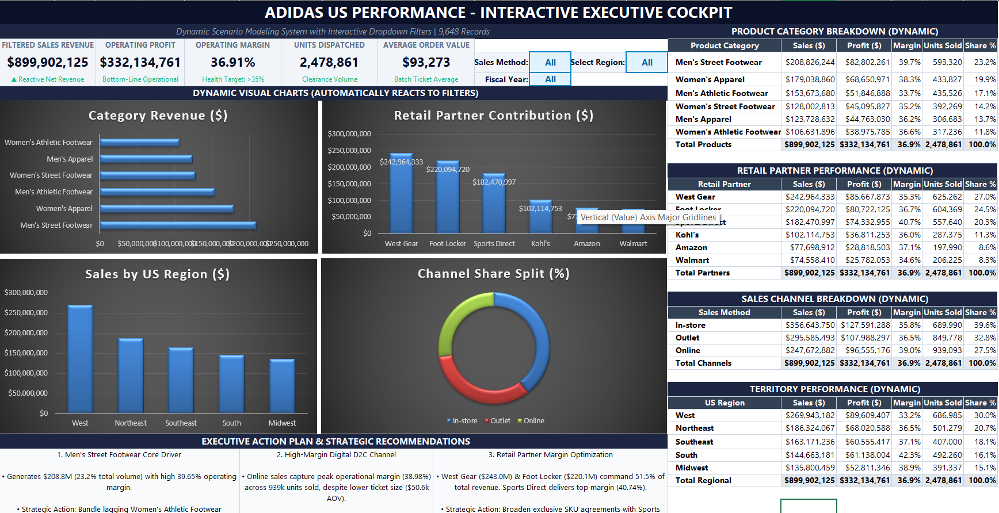

# Adidas US Sales Performance Dashboard

An interactive sales analytics system built on 9,648 US transaction records (FY 2020–2021) to evaluate omnichannel revenue, product line profitability, and regional partner performance.

---

## Dashboard Preview



---

## Executive KPIs (FY 2020–2021)

| Metric | Value | Definition |
| :--- | :--- | :--- |
| **Total Net Sales** | **$899,902,125** | Cumulative net sales revenue across all channels |
| **Operating Profit** | **$332,134,761** | Total earnings after cost allocations |
| **Operating Margin** | **36.91%** | Overall operational efficiency ($\frac{\text{Profit}}{\text{Sales}}$)[cite: 4] |
| **Units Dispatched** | **2,478,861**[cite: 4] | Total volume of apparel and footwear sold[cite: 4] |
| **Average Order Value (AOV)** | **$93,273**[cite: 4] | Average transaction ticket size per invoice[cite: 4] |

---

## Key Business Insights

* **Flagship Product**: **Men's Street Footwear** drives the business with **$208.8M** in sales and a **39.65% operating margin**[cite: 4].
* **Margin Optimization**: While **In-store** generates the highest gross sales ($356.6M), the **Online channel** yields the highest margin efficiency at **38.98%**[cite: 4].
* **Territory Lead**: The **West Region** accounts for 30.0% of enterprise sales ($269.9M), while the **South Region** operates at the highest margin (42.26%)[cite: 4].
* **Partner Concentration**: **West Gear** ($243.0M) and **Foot Locker** ($220.1M) command 51.5% of total sales volume[cite: 4].

---

## Repository Structure

```text
├── Adidas US Sales Datasets.xlsx             # Source raw transactional dataset (9,648 rows)
├── Adidas_Interactive_Sales_Dashboard.xlsx   # Dynamic Excel model with slicer dropdowns & reactive charts
├── Adidas_Interactive_Sales_Dashboard.png    # Dashboard screenshot for preview
└── README.md                                 # Project documentation